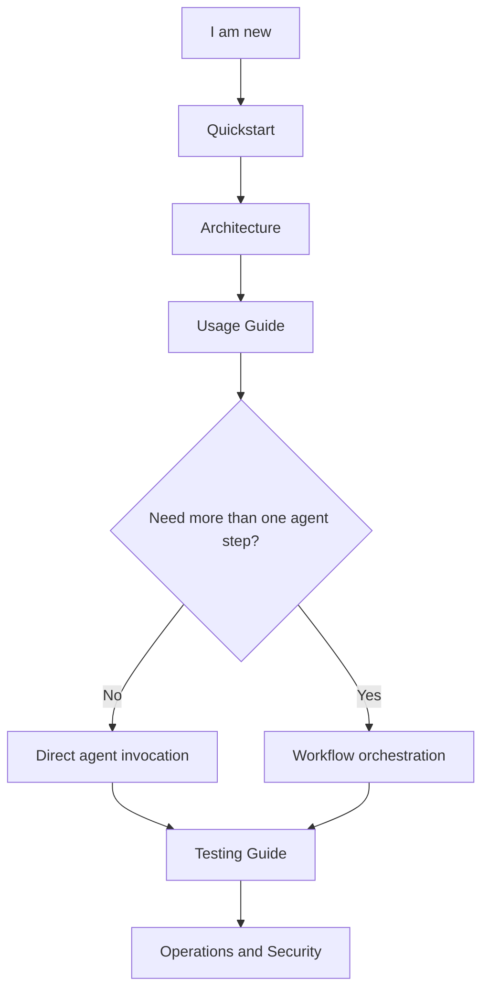
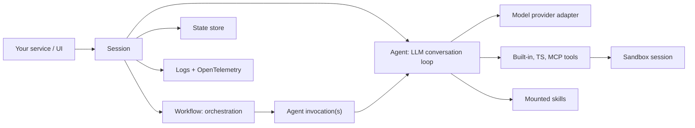

# PURISTA Agent Harness Documentation

`@purista/harness` is a TypeScript runtime for building self-hosted agent
systems. It gives application teams one provider-neutral boundary for sessions,
direct agents, optional workflows, tools, skills, state, sandboxing, logs, and
traces.

The harness is infrastructure, not a hosted SaaS product. You embed it in your
service, choose the adapters, and keep control over data, execution, and
observability.

## Who This Is For

| Reader | What You Need |
|---|---|
| New joiner | A mental model, the first working run, and where each concept lives. |
| Application developer | How to define agents, workflows, tools, skills, and sessions. |
| Platform engineer | How adapters, MCP, sandboxing, telemetry, and state fit together. |
| Operator | How to verify, observe, troubleshoot, and shut down harness services. |
| Security reviewer | Trust boundaries, sandbox behavior, secret handling, and redaction defaults. |

## Start Here

## Documentation Map

- Start building
  - [Quickstart](./getting-started/quickstart.md): install, run the smallest example, and verify the harness works.
  - [Living Wiki Jaeger Example](../examples/living-wiki-jaeger/README.md): explore a full research workspace with agents, workflows, review gates, artifacts, MCP, and Jaeger.
- Learn the model
  - [Architecture](./concepts/architecture.md): understand sessions, agents, workflows, tools, skills, state, sandboxing, and telemetry.
  - [Common Scenarios And Use Cases](./guides/common-scenarios.md): choose patterns for RAG, triage, human review, research, reports, and multi-agent work.
- Build applications
  - [Usage Guide](./guides/usage.md): define a harness, open sessions, invoke agents, stream runs, and orchestrate workflows.
  - [Configuration Guide](./guides/configuration.md): configure models, defaults, sandboxing, timeouts, logging, and OpenTelemetry.
  - [Extending And Customizing](./guides/extending-and-customizing.md): add adapters, TypeScript tools, skills, workflows, and custom state/sandbox implementations.
  - [MCP Tools](./guides/mcp-tools.md): register stdio and HTTP MCP tools, install stdio servers inside the sandbox, and map MCP failures.
  - [Testing Guide](./guides/testing.md): test agents, workflows, streams, tools, MCP runners, and review gates.
- Operate and review
  - [Operations Runbook](./operations/runbook.md): readiness checks, failure handling, logs, traces, MCP operations, and shutdown.
  - [Security Model](./security/security-model.md): trust boundaries, secret handling, sandbox execution, MCP risk, review gates, and telemetry privacy.
- Reference
  - [Public API](./reference/public-api.md): package exports, builder shape, session API, run events, errors, and type inference.
  - [Spec Conformance](./reference/spec-conformance.md): current implementation status against the approved specs.

## Repository Map

| Path | Purpose |
|---|---|
| `packages/harness` | Core runtime, builder, sessions, agents, workflows, tools, sandbox, state, telemetry, errors. |
| `packages/harness-openai` | OpenAI model provider adapter. |
| `examples/quickstart` | Smallest typed harness example. |
| `examples/showcase` | Skills, TypeScript tools, and multiple workflows. |
| `examples/living-wiki-jaeger` | Full local research workspace with SSE, Jaeger, artifacts, review gates, Mermaid, draw.io XML, JSON panels, and Three.js graph. |
| `specs/` | Approved technical specifications. Use specs for implementation detail, not first-time onboarding. |

## Runtime In One Diagram

The application API is `harness.getSession(...)`, then
`session.agents.<id>` or `session.workflows.<id>`. Providers, tools, sandboxes,
and state stores are infrastructure behind that boundary.

In harness terminology, an **agent** is the typed LLM conversation loop: it
builds prompts, calls a model, executes tool invocations, feeds tool results
back into the model, validates the final output, and emits run events. A
**workflow** is application orchestration: it decides which agents to invoke,
in what order or parallel shape, where review gates happen, and when durable
side effects such as wiki writes or report artifacts are allowed.
