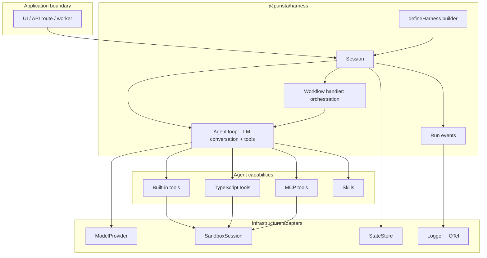
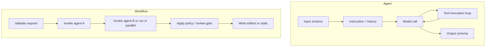
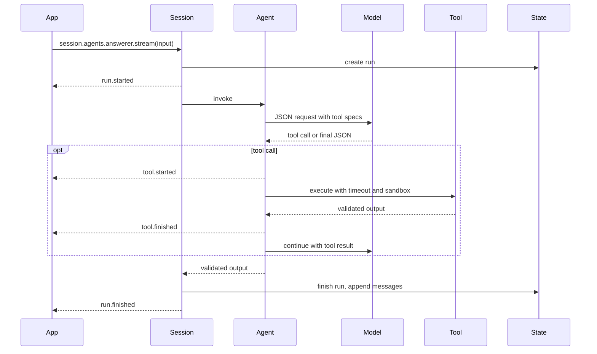
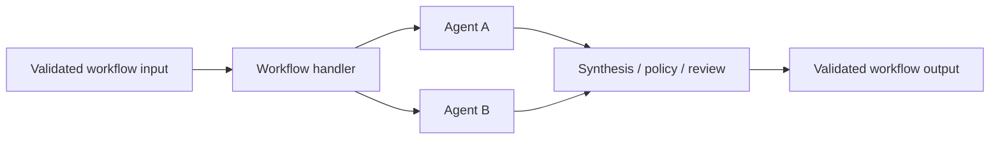
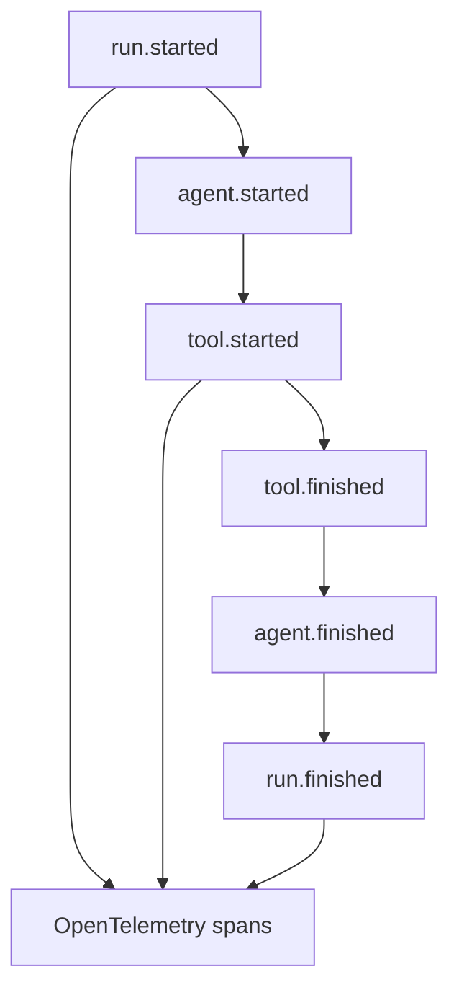

# Architecture

The harness is an in-process TypeScript runtime. It sits between your
application and external model providers, tools, state, sandbox execution, and
telemetry.

## Mental Model

## Core Concepts

| Concept | What It Does | User Decision |
|---|---|---|
| `Harness` | Compiled definition of models, tools, skills, agents, workflows, defaults, and adapters. | What capabilities exist? |
| `Session` | Isolated operational context with memory, history, sandbox, and one active run at a time. | What user/thread/tenant is this run for? |
| `Agent` | A typed LLM conversation loop. It prepares messages, calls the model, executes tool invocations, appends tool results, repeats until the model returns, validates output, and emits events. | What single model-driven job should this loop perform? |
| `Workflow` | Application-owned orchestration around one or more agent invocations. It can sequence, branch, fan out, reflect, judge, request human approval, and perform durable writes. | What business process or multi-step flow must happen around agents? |
| `Tool` | Callable capability exposed to an agent: built-in, TypeScript, or MCP. | What can the agent do besides model calls? |
| `Skill` | Mounted instruction directory with `SKILL.md` frontmatter. | What reusable method or domain guidance should the agent follow? |
| `Sandbox` | Filesystem and optional command execution boundary. | Can this run execute commands, and with what isolation? |

## Agents Versus Workflows

Use an agent when the unit of work is one LLM conversation loop, even if that
loop uses several tools. Use a workflow when the application needs to control
multiple agent invocations, approval steps, deterministic logic, persistence,
or side effects.

## Direct Agent Lifecycle

## Workflow Lifecycle

Workflows are not required. Use them when the application needs explicit
orchestration around agents.

## Event And Trace Shape

All streaming APIs emit run events. Applications can render these events in a
chat UI, run inspector, logs, or tests.

By default, persisted events and spans avoid full content capture. Enable
content capture only for deliberate local diagnostics.
