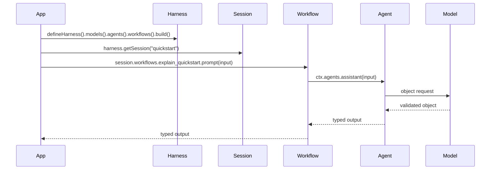

# Quickstart

This guide gets a new developer from clone to a typed harness run.

## What You Build

The quickstart example creates:

- one OpenAI-backed model alias;
- one typed agent, which is the LLM conversation loop;
- one typed workflow, which orchestrates a call to that agent;
- one session;
- one workflow invocation.

Direct agent invocation uses the same session API and is covered after the first
run.

## Prerequisites

- Node.js `>=20` and `<25`
- npm
- an OpenAI API key for live runs

## Install

From the repository root:

```bash
npm install
cp .env.example .env
```

Set:

```env
OPENAI_API_KEY=sk-...
OPENAI_MODEL=gpt-5-mini
```

Examples read the repository-root `.env`; do not create example-local `.env`
files.

## Run

```bash
npm run build --workspace @purista/quickstart
npm run start --workspace @purista/quickstart
```

Expected output is a short answer about enterprise agent harnesses.

## Verify The Repo

```bash
npm run typecheck
npm test
npm run build
```

## Read The Flow

[examples/quickstart/src/index.ts](../../examples/quickstart/src/index.ts)
does this:



The key rule: application code calls sessions, not provider adapters directly.
In this flow, the workflow owns orchestration and the agent owns the model loop.
The agent prepares messages, calls the model, handles tool calls when available,
and returns validated output. The workflow decides when that agent is invoked
and what happens before or after it.

## Direct Agent Alternative

When you do not need application orchestration, call the agent's LLM
conversation loop directly:

```ts
const session = await harness.getSession('quickstart')
const response = await session.agents.assistant.prompt({
  topic: 'enterprise agent harnesses'
})
```

Use workflows when you need pre-processing, post-processing, fan-out/fan-in,
human review, retries, durable writes, or a business process run.

## Next Steps

- [Architecture](../concepts/architecture.md)
- [Usage Guide](../guides/usage.md)
- [Testing Guide](../guides/testing.md)
- [Living Wiki Jaeger Example](../../examples/living-wiki-jaeger/README.md)
