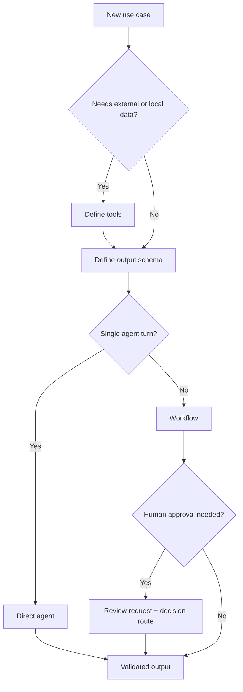
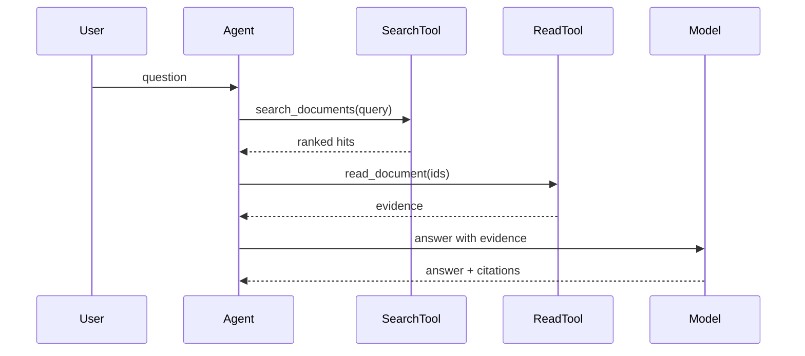
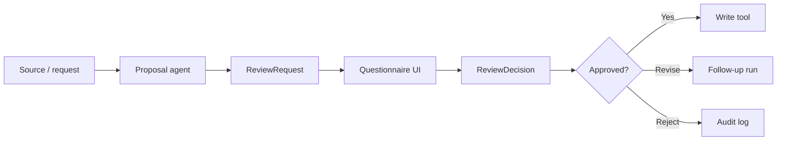
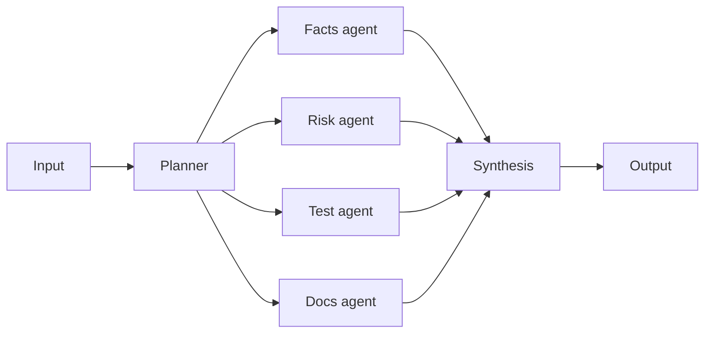

# Common Scenarios And Use Cases

Start with the smallest useful execution shape. Add workflow orchestration only
when the application needs explicit process control.

In this guide, an agent means one typed LLM conversation loop. A workflow means
application code that coordinates one or more agent invocations with policy,
review, persistence, or other deterministic steps.

## Decision Guide



## RAG And Source-Grounded Q&A

Use direct agent invocation when the user asks a question and one LLM
conversation loop can retrieve enough context through tools.



Recommended output schema:

```ts
z.object({
  answer: z.string(),
  citations: z.array(z.object({
    id: z.string(),
    quoteOrSummary: z.string(),
    confidence: z.enum(['low', 'medium', 'high'])
  })),
  confidenceNotes: z.array(z.string())
})
```

Add a workflow when you need query rewriting before the agent, multiple
retriever agents, answer grading after the agent, or durable report artifacts.

## Human-In-The-Loop Review

Use a workflow when proposed changes should not be applied until a human
approves them. The proposal agent drafts the change; the workflow owns the gate
and decides whether a write tool may run.



Required behavior:

- no mutation before approval;
- visible review questions and recommended answers;
- immediate answer capture when a user selects an option;
- idempotent final decision submission;
- stale run/review ids fail with a clear error.

## Triage And Routing

Use a direct triage agent for simple classification. Use a workflow when triage
starts downstream work such as routing, notification, enrichment, review, or
artifact generation.

Good triage output fields:

- `priority`
- `category`
- `owner`
- `nextAction`
- `confidence`
- `reason`

Keep triage outputs narrow. Downstream agents should consume typed fields, not
parse triage prose.

## Parallel Agents

Use workflows for fan-out/fan-in. Each branch can be a separate agent
conversation loop with its own instructions, tools, and output schema.



This pattern fits code review, incident analysis, research synthesis, and large
document audits.

## Plan, Reason, Reflect, Judge

Use this workflow shape when correctness matters more than raw speed.

| Phase | Responsibility |
|---|---|
| Plan | Define scope, sources, and expected output. |
| Retrieve | Gather evidence through tools. |
| Reason | Produce the draft answer, decision, or report. |
| Reflect | Find unsupported claims, contradictions, and missing context. |
| Judge | Score readiness and produce review questions when needed. |
| Publish | Persist artifacts or apply approved changes. |

The Living Wiki example uses this shape for decision memos, architecture
reviews, and wiki audits.

## Artifact Generation

Use artifacts when users need durable outputs beyond chat text:

- markdown reports;
- Mermaid diagrams;
- draw.io XML;
- JSON-rendered panels;
- SVG or image previews;
- graph nodes and edges.

Artifacts should include manifest metadata: id, title, kind, content type,
source pages, creating run id, digest, and size.

## Living Wiki Pattern

The Living Wiki Jaeger example combines:

- direct wiki Q&A agent;
- source ingest workflow;
- decision memo workflow;
- architecture review workflow;
- wiki audit workflow;
- human review gate;
- SSE run inspector;
- Jaeger trace links;
- Mermaid, draw.io XML, JSON panels, and Three.js graph.

Use it as the reference for a real application that showcases the harness
without requiring external services by default.
