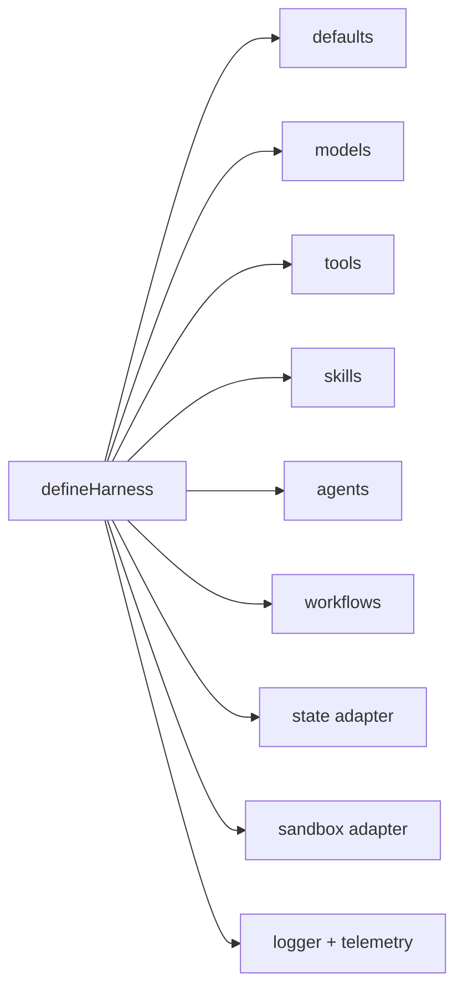

# Configuration Guide

Start with safe defaults, then add explicit adapters when your application
needs durability, command execution, observability, or external tools.

## Minimal Configuration

```ts
const harness = defineHarness({ name: 'my-service' })
  .models({
    fast: {
      provider: openai({ apiKey: process.env.OPENAI_API_KEY! }),
      model: process.env.OPENAI_MODEL ?? 'gpt-5-mini',
      capabilities: ['json']
    }
  })
  .agents(({ agent }) => ({
    assistant: agent({
      model: 'fast',
      builtinTools: false,
      instructions: 'Return concise JSON.'
    })
  }))
  .build()
```

## Configuration Map



| Area | Default | Configure When |
|---|---|---|
| Logger | `JsonLogger` | You need structured logs at a specific level or sink. |
| State | In-memory state | Runs/history must survive process restart. |
| Sandbox | Auto-detect `bashSandbox()`, fallback to `inMemorySandbox()` | You need predictable execution policy. |
| Models | Required | Every agent needs a model alias. |
| Tools | Optional | Agents need retrieval, writes, MCP, or application APIs. |
| Skills | Optional | Agents need reusable instructions or report methods. |
| Workflows | Optional | You need orchestration beyond one agent turn. |

## Models

```ts
.models({
  fast: {
    provider: openai({
      apiKey: process.env.OPENAI_API_KEY!,
      baseURL: process.env.OPENAI_BASE_URL,
      organization: process.env.OPENAI_ORG,
      project: process.env.OPENAI_PROJECT
    }),
    model: process.env.OPENAI_MODEL ?? 'gpt-5-mini',
    capabilities: ['json', 'tool_use'],
    defaults: { maxTokens: 1200 }
  }
})
```

Capabilities gate runtime calls:

| Capability | Enables |
|---|---|
| `text` | Plain text generation. |
| `text_stream` | Plain text streaming. |
| `json` | Structured JSON generation. |
| `json_stream` | Structured JSON streaming. |
| `tool_use` | Model tool calling. |
| `vision_input` | Image input understanding where adapter supports it. |

## Defaults

```ts
.defaults({
  runTimeoutMs: 600_000,
  modelTimeoutMs: 300_000,
  toolTimeoutMs: 120_000,
  skillTimeoutMs: 60_000,
  agentMaxIterations: 16,
  historyWindow: 20
})
```

Use smaller budgets for user-facing request/response paths and larger budgets
for background research workflows.

## Sandbox

```ts
import { bashSandbox, inMemorySandbox } from '@purista/harness'

.sandbox(inMemorySandbox()) // file-only, no command execution
.sandbox(bashSandbox())     // command execution through just-bash
```

Choose `inMemorySandbox()` when agents do not need command execution. Choose an
executor-capable sandbox for built-in `bash`, exec-backed `grep`, and
`mcp_stdio`.

## Telemetry And Logs

```ts
.logger(new JsonLogger({ level: process.env.PURISTA_HARNESS_LOG_LEVEL ?? 'info' }))
.telemetry({ captureContent: false })
```

`captureContent` defaults to false. Keep it false outside local diagnostics.

## Environment Variables Used By Examples

| Variable | Purpose |
|---|---|
| `OPENAI_API_KEY` | Enables live OpenAI calls. |
| `OPENAI_MODEL` | Model name used by examples, default `gpt-5-mini`. |
| `OPENAI_BASE_URL` | Optional OpenAI-compatible endpoint. |
| `OPENAI_ORG` / `OPENAI_PROJECT` | Optional OpenAI account routing. |
| `PURISTA_HARNESS_LOG_LEVEL` | Logger level for `JsonLogger`. |
| `OTEL_EXPORTER_OTLP_ENDPOINT` | OTLP/HTTP endpoint for traces, default example value `http://localhost:4318`. |
| `LIVING_WIKI_DRAWIO_MCP_*` | Optional Living Wiki draw.io MCP integration. |

## Production Checklist

- Use durable `StateStore` for long-lived sessions and audit history.
- Define tenant-safe session IDs.
- Set explicit timeout budgets.
- Keep content capture disabled unless approved.
- Use permission gates for mutating built-in tools.
- Use executor-capable sandbox only where command execution is required.
- Test provider failures, validation failures, cancellation, and shutdown.
