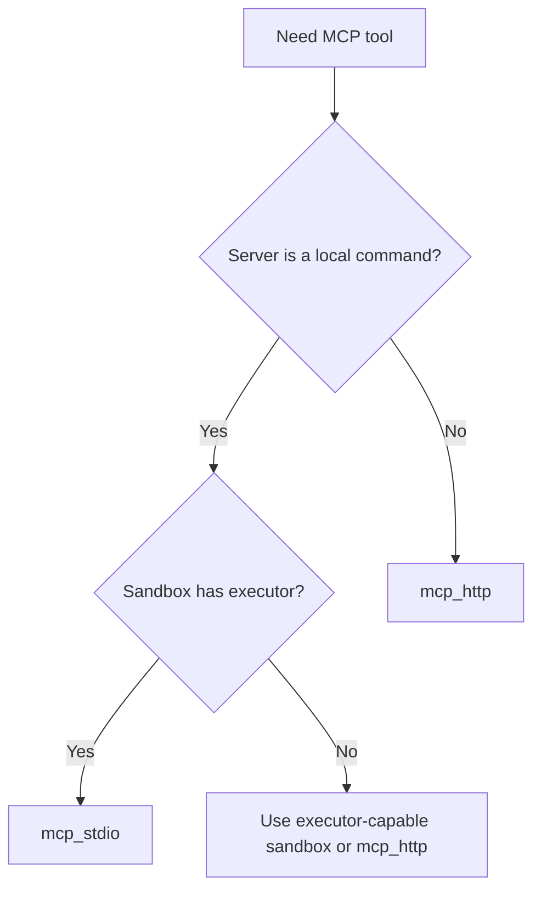
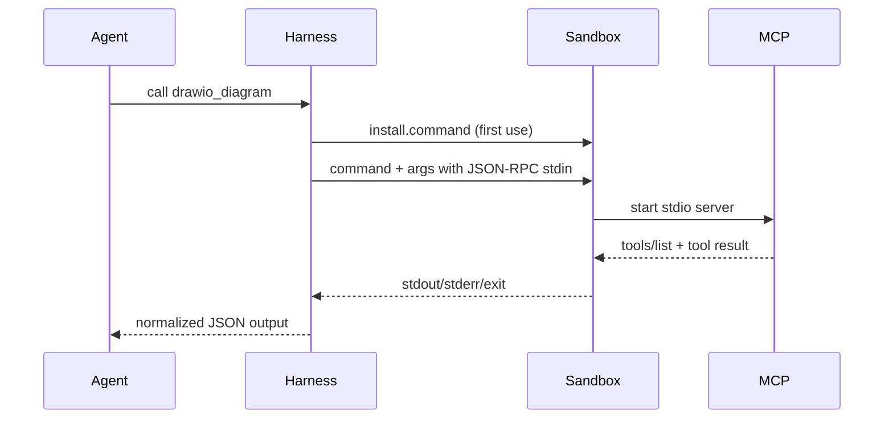

# MCP Tools

MCP tools let agents call capabilities exposed by Model Context Protocol
servers. The harness supports two transport modes.

| Mode | Use When | Execution Boundary |
|---|---|---|
| `mcp_stdio` | The MCP server is a local command. | Runs through `SandboxSession.exec`. |
| `mcp_http` | The MCP server is already running remotely or sidecar-local over HTTP. | Uses HTTP; no local process launch. |

## Transport Decision



## Stdio Runs In The Sandbox

`mcp_stdio` commands are executed through the active `SandboxSession.exec`.
They must not be spawned directly from the host process. This keeps filesystem,
network, timeout, cancellation, logging, and tracing policy aligned with the
rest of the harness.

If the session sandbox has `executor: 'unavailable'`, stdio MCP fails with
`SandboxNoExecutorError`.

## Installing A Stdio MCP Server

Use `install` to bootstrap the MCP server inside the sandbox before first use:

```ts
.tools({
  drawio_diagram: {
    kind: 'mcp_stdio',
    description: 'Create draw.io diagrams from structured architecture notes.',
    install: {
      command: 'npm install @drawio/mcp',
      cwd: '/workspace',
      timeoutMs: 120_000
    },
    command: 'npx',
    args: ['@drawio/mcp'],
    tool: 'drawio.create'
  }
})
```

Lifecycle:



## HTTP MCP

Use `mcp_http` when the MCP server is already available over streamable HTTP:

```ts
.tools({
  drawio_remote: {
    kind: 'mcp_http',
    description: 'Create draw.io diagrams through a remote MCP server.',
    url: process.env.DRAWIO_MCP_URL!,
    auth: { kind: 'bearer', token: process.env.DRAWIO_MCP_TOKEN! },
    tool: 'drawio.create'
  }
})
```

Supported auth:

- `none`
- `bearer`
- `oauth2`
- `api_key`
- `basic`

## Validation And Errors

The harness calls `tools/list`, validates MCP input/output JSON Schema, and
normalizes MCP response envelopes before returning output to the model.

| Failure | Error |
|---|---|
| Sandbox has no executor for stdio | `SandboxNoExecutorError` |
| Unknown upstream MCP tool | `ToolNotFoundError` |
| Invalid MCP input/output | `ValidationError` |
| MCP protocol/list/call failure | `McpProtocolError` |
| HTTP auth failure | `McpAuthError` |
| MCP tool returns `isError: true` | `ToolError` |

## Living Wiki draw.io Example

The Living Wiki app runs without draw.io MCP by default. To enable a real server:

```env
LIVING_WIKI_DRAWIO_MCP_INSTALL=npm install @drawio/mcp
LIVING_WIKI_DRAWIO_MCP_COMMAND=npx
LIVING_WIKI_DRAWIO_MCP_ARGS=@drawio/mcp
LIVING_WIKI_DRAWIO_MCP_TOOL=drawio.create
```

Or use HTTP:

```env
LIVING_WIKI_DRAWIO_MCP_URL=https://example.test/mcp
LIVING_WIKI_DRAWIO_MCP_AUTH_TOKEN=...
```
