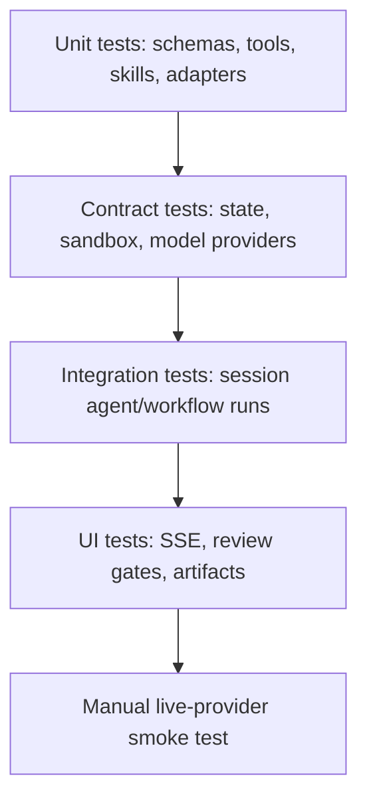

# Testing Guide

Test harness applications without calling external model providers by injecting
fake providers, fake stores, and local fixtures.

## Test Pyramid



## Default Repo Checks

```bash
npm run lint
npm run typecheck
npm test
npm run test:contracts
npm run test:integration
npm run test:failure
npm run build
```

## Test With A Fake Model Provider

```ts
const provider = {
  id: 'fake',
  genAiSystem: 'fake',
  async object() {
    return {
      object: { answer: 'fake answer', citations: [] },
      usage: { inputTokens: 1, outputTokens: 1, totalTokens: 2 },
      finishReason: 'stop'
    }
  }
}

const harness = createAppHarness(provider)
const session = await harness.getSession('test')
await expect(session.agents.answerer.prompt({ question: 'hi' }))
  .resolves.toMatchObject({ answer: 'fake answer' })
```

## Test Streaming Events

```ts
const events = []
for await (const event of session.workflows.audit.stream({ scope: 'all' })) {
  events.push(event.type)
}

expect(events).toContain('run.started')
expect(events).toContain('run.finished')
```

## Test Tools

Call TypeScript tool handlers with a small context object and a temporary store.
Assert both successful output and validation failure behavior.

## Test MCP

Use local fake MCP servers for contract tests. Stdio MCP should prove:

- the command runs through the sandbox executor;
- `SandboxNoExecutorError` is thrown when no executor is available;
- input and output schemas are validated;
- timeout, cancellation, process failure, and retry behavior are covered.

HTTP MCP should prove auth failures, protocol failures, schema validation, and
normal success.

## Test Review Gates

For human-in-the-loop flows:

- assert no mutation happens before approval;
- assert answer choices are submitted to the backend;
- assert decisions are idempotent;
- assert stale review ids and stale run ids fail cleanly.

The Living Wiki example covers these patterns in
`examples/living-wiki-jaeger/src/backend/app.test.ts` and
`examples/living-wiki-jaeger/src/frontend/app.ui.test.tsx`.
