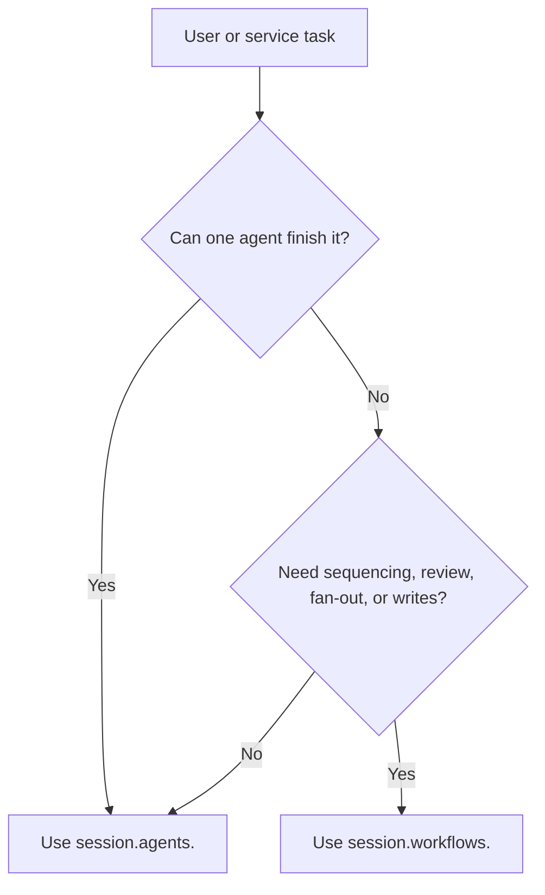

# Usage Guide

Build a system by composing a harness, then run work through a session. The
session is the application API. Adapters are infrastructure.

## Choose The Execution Shape



Use a direct agent when the work is one typed LLM conversation loop: chat, Q&A,
summarization, classification, extraction, or a simple tool-backed task. The
agent may call tools multiple times, but the model loop remains the unit of
work.

Use a workflow when your application needs to orchestrate multiple agent
invocations or combine agents with deterministic steps: ingest, review,
triage, planning, reflection, judging, report creation, reconciliation,
approval gates, or durable writes.

## Define A Harness

```ts
import { z } from 'zod'
import { defineHarness, JsonLogger } from '@purista/harness'
import { openai } from '@purista/harness-openai'

const answerInput = z.object({ question: z.string() })
const answerOutput = z.object({
  answer: z.string(),
  citations: z.array(z.string())
})

const harness = defineHarness({ name: 'docs-example' })
  .logger(new JsonLogger({ level: 'info' }))
  .models({
    fast: {
      provider: openai({ apiKey: process.env.OPENAI_API_KEY! }),
      model: process.env.OPENAI_MODEL ?? 'gpt-5-mini',
      capabilities: ['object', 'tool_use']
    }
  })
  .tools({
    search_docs: {
      description: 'Search internal documentation.',
      input: z.object({ query: z.string() }),
      output: z.object({ hits: z.array(z.object({ id: z.string(), text: z.string() })) }),
      handler: async (_ctx, input) => ({
        hits: [{ id: 'intro', text: `Result for ${input.query}` }]
      })
    }
  })
  .agents(({ agent }) => ({
    answerer: agent({
      model: 'fast',
      input: answerInput,
      output: answerOutput,
      tools: ['search_docs'],
      builtinTools: false,
      instructions: 'Search docs before answering. Return a cited object.'
    })
  }))
  .workflows(({ workflow }) => ({
    answer_with_review: workflow({
      input: answerInput,
      output: answerOutput,
      handler: async (ctx) => ctx.agents.answerer(ctx.input)
    })
  }))
  .build()
```

## Open A Session

```ts
const session = await harness.getSession('tenant-a:user-42')
```

A session provides:

| API | Purpose |
|---|---|
| `session.agents.<id>.prompt(input)` | Direct agent call. |
| `session.agents.<id>.stream(input)` | Direct agent call with run events. |
| `session.workflows.<id>.prompt(input)` | Workflow call. |
| `session.workflows.<id>.stream(input)` | Workflow call with run events. |
| `session.history.list()` | Conversation messages for this session. |
| `session.memory.read/write/delete/list()` | JSON memory stored under the session sandbox. |
| `session.close()` | Close the sandbox session. |

Sessions enforce one active run at a time. Use different session IDs for
parallel user threads.

## Invoke A Direct Agent

A direct agent call enters the conversation loop for one configured agent. The
agent can call models and tools until it has a validated output.

```ts
const result = await session.agents.answerer.prompt({
  question: 'How do tools work?'
})

console.log(result.answer)
```

## Stream A Run

```ts
for await (const event of session.agents.answerer.stream({
  question: 'How do tools work?'
})) {
  if (event.type === 'tool.started') console.log('tool:', event.toolId)
  if (event.type === 'run.finished') console.log(event.output)
}
```

Streaming reports lifecycle and tool events. If your provider and agent path
support model streaming, render partial content as it arrives; otherwise render
tool progress and final output.

Harness streams are typed `RunEvent` values. They are not the Vercel stream
protocol; application HTTP or SSE routes can map them to whatever client event
shape they own.

## Use Provider Runtime Capabilities

Declare the model operations each alias may use. Structured outputs use the
`object` vocabulary; legacy `json` capability names should not appear in new
docs or examples.

```ts
.models({
  reasoning: {
    provider: openai({ apiKey: process.env.OPENAI_API_KEY! }),
    model: process.env.OPENAI_MODEL ?? 'gpt-5-mini',
    capabilities: ['text', 'object', 'object_stream', 'tool_use', 'vision_input']
  },
  retrieval: {
    provider: openai({ apiKey: process.env.OPENAI_API_KEY! }),
    model: process.env.OPENAI_EMBEDDING_MODEL ?? 'text-embedding-3-small',
    capabilities: ['embeddings']
  },
  ranker: {
    provider: customRanker,
    model: 'ranker-v1',
    capabilities: ['rerank']
  }
})
```

Object generation is the typed structured-output path. Multimodal inputs are
normal model message parts, gated by `vision_input`, `audio_input`, or
`file_input` depending on the part kind. Embeddings and reranking are provider
operations for retrieval workflows; vector storage and RAG orchestration remain
application or workflow code.

## Invoke A Workflow

A workflow call enters your orchestration code. That code can invoke one agent,
invoke several agents in sequence or parallel, run deterministic checks, ask
for human review, and decide whether to write state or artifacts.

```ts
const result = await session.workflows.answer_with_review.prompt({
  question: 'How do tools work?'
})
```

The workflow handler owns orchestration. It can call one agent, many agents,
tools, state, or human-review logic before returning validated output.

## Manage Memory And History

```ts
await session.memory.write('last-topic', { topic: 'tools' })
const lastTopic = await session.memory.read<{ topic: string }>('last-topic')

const messages = await session.history.list({ limit: 20 })
```

Memory is session-scoped. History is persisted through the configured
`StateStore`.

## Shut Down

```ts
await session.close()
await harness.shutdown()
```

Call `harness.shutdown()` during service shutdown so adapters and MCP runners
can close cleanly.
