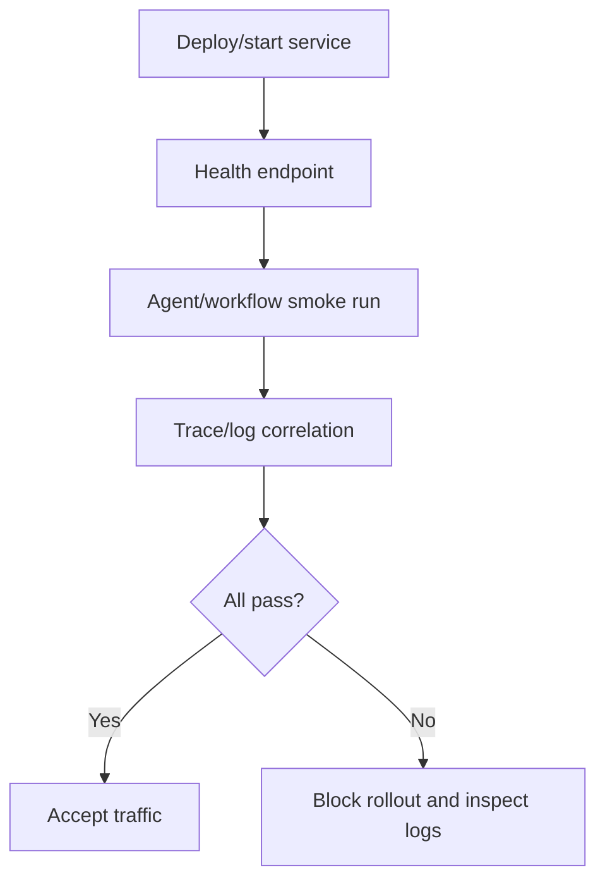

# Operations Runbook

Use this runbook for local verification, service readiness, observability, and
failure triage.

## Standard Verification Gates

```bash
npm run lint
npm run typecheck
npm test
npm run test:contracts
npm run test:integration
npm run test:failure
npm run build
```

## Service Readiness

Before exposing a harness-backed service:

- verify session creation;
- verify direct agent invocation;
- verify every workflow entrypoint;
- verify tool and MCP failures map to harness errors;
- verify cancellation and timeout behavior;
- verify `harness.shutdown()` closes adapters and MCP runners.



## Observability

Use structured logs and OpenTelemetry together.

| Signal | What To Look For |
|---|---|
| Logs | `run_id`, `session_id`, `agent_id`, `workflow_id`, `tool_id`, error code, retriable flag. |
| Traces | request, session, workflow, agent, model, tool, and sandbox spans. |
| Events | `run.started`, `tool.started`, `tool.finished`, `agent.finished`, `run.finished`, overflow events. |

Jaeger local example:

```bash
npm run jaeger --workspace @purista/living-wiki-jaeger-example
```

Set:

```env
OTEL_EXPORTER_OTLP_ENDPOINT=http://localhost:4318
```

## Common Failures

| Symptom | Likely Cause | Action |
|---|---|---|
| `SessionBusyError` | Two runs started in one session. | Use distinct session IDs or wait for the current run. |
| `OperationTimeoutError` | Run/model/tool exceeded budget. | Tune `defaults`, inspect provider/tool latency. |
| `ValidationError` | Input/output schema mismatch. | Check Zod issues in logs and traces. |
| `ModelError` | Provider HTTP/network/error response. | Inspect normalized metadata: status, provider type, request id, body summary. |
| `SandboxNoExecutorError` | Command execution requested in files-only sandbox. | Use `bashSandbox()` or disable exec-backed tools. |
| `McpProtocolError` | MCP list/call/protocol failure. | Check MCP command/url, schema, timeout, stderr/logs. |
| `McpAuthError` | HTTP MCP auth failed. | Rotate/check token and auth config. |

## MCP Operations

For `mcp_stdio`:

- install and execution happen inside the sandbox;
- `install.command` should be idempotent;
- use explicit timeouts;
- do not rely on host-local binaries unless the sandbox exposes them;
- verify no secrets are logged.

For `mcp_http`:

- monitor endpoint availability;
- rotate auth secrets;
- test non-2xx responses;
- verify request bodies are not logged by default.

## Recovery

1. Identify `run_id` from the UI, logs, or API response.
2. Inspect structured logs for the matching `run_id`.
3. Inspect trace if `traceId` or Jaeger link is present.
4. Check final `run.finished` event for normalized error metadata.
5. Fix provider/tool/config issue.
6. Re-run a smoke test.
7. Call `harness.shutdown()` during controlled process shutdown.
