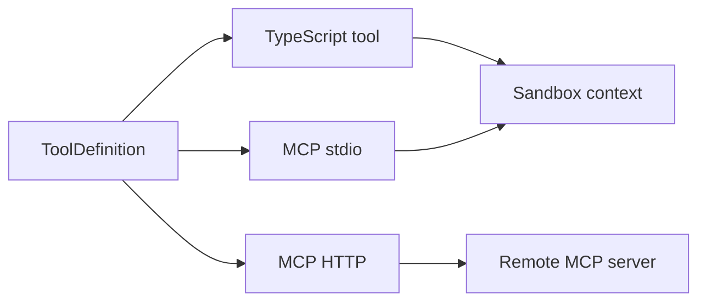

# Public API Overview

This page summarizes the public surface most application developers need. The
full contract is specified in [specs/13-public-api.md](../../specs/13-public-api.md).

## Packages

| Package | Purpose |
|---|---|
| `@purista/harness` | Core runtime: builder, sessions, agents, workflows, tools, sandbox, state, telemetry, errors. |
| `@purista/harness-openai` | OpenAI model provider adapter. |

## Application API

```ts
const harness = defineHarness({ name: 'my-service' })
  .models(...)
  .tools(...)
  .skills(...)
  .agents(...)
  .workflows(...)
  .build()

const session = await harness.getSession('tenant:user:thread')
const answer = await session.agents.answerer.prompt(input)
const report = await session.workflows.research_report.prompt(input)
await harness.shutdown()
```

## Main Types

| Type | What It Represents |
|---|---|
| `Harness<S>` | Built runtime with `getSession`, `shutdown`, and `$infer`. |
| `Session<S>` | Operational context exposing `agents`, `workflows`, `history`, `memory`, and `close`. |
| `AgentInvoker` | `prompt(input)` and `stream(input)` for direct agent runs. |
| `WorkflowInvoker` | `prompt(input)` and `stream(input)` for workflow runs. |
| `ModelProvider` | Adapter interface implemented by provider packages. |
| `StateStore` | Persistence port for sessions, runs, messages, and events. |
| `Sandbox` / `SandboxSession` | File and optional command execution boundary. |
| `ToolDefinition` | TypeScript, MCP stdio, or MCP HTTP tool config. |

## Tool Definitions



TypeScript tools validate with Zod before and after handler execution.

MCP stdio tools:

- include `kind: 'mcp_stdio'`;
- can include `install`;
- run install and execution through the active sandbox executor.

MCP HTTP tools:

- include `kind: 'mcp_http'`;
- call a remote streamable HTTP MCP endpoint;
- support `none`, `bearer`, `oauth2`, `api_key`, and `basic` auth.

## Run Events

Streaming invokers yield `RunEvent` values:

| Event | Meaning |
|---|---|
| `run.started` | Run record exists and execution began. |
| `agent.started` / `agent.finished` | Agent lifecycle. |
| `tool.started` / `tool.finished` | Tool lifecycle and normalized errors. |
| `model.message` | Persisted model message metadata. |
| `run.finished` | Final output or serialized error. |
| `stream.overflow` | Stream buffer dropped old events. |

## Error Families

All harness errors include `code`, `category`, `retriable`, `message`, and
optional `meta`.

Common codes:

- `VALIDATION_ERROR`
- `MODEL_ERROR`
- `MODEL_CAPABILITY_ERROR`
- `TOOL_ERROR`
- `TOOL_NOT_FOUND`
- `MCP_PROTOCOL_ERROR`
- `MCP_AUTH_ERROR`
- `SANDBOX_NO_EXECUTOR`
- `OPERATION_TIMEOUT`
- `OPERATION_CANCELLED`
- `SESSION_BUSY`

## OpenAI Adapter

```ts
import { openai } from '@purista/harness-openai'

const provider = openai({
  apiKey: process.env.OPENAI_API_KEY!,
  baseURL: process.env.OPENAI_BASE_URL
})
```

The adapter extends `BaseModelProvider`, inherits harness logger/telemetry, and
normalizes provider HTTP/network errors into `ModelError` with actionable
metadata.

## Type Inference

The builder preserves literal keys across models, tools, skills, agents, and
workflows. Invalid references, such as an agent pointing at a missing model or
tool, should fail at the builder call site.

Use `harness.$infer` for compile-time inspection of the configured surface.
