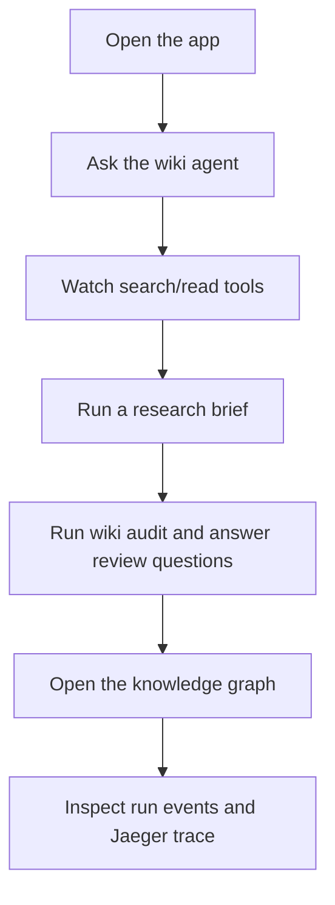
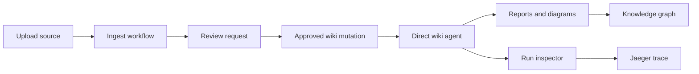
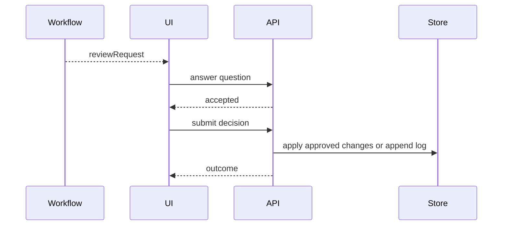

# Living Wiki Jaeger Example

`@purista/living-wiki-jaeger-example` is a local research workspace that shows
how to build a real application on top of the harness.

It demonstrates:

- direct agent chat through `session.agents`, where an agent is the typed LLM
  conversation loop with model calls and tool invocations;
- structured object outputs for reports, review requests, graph highlights,
  and JSON-rendered panels;
- optional workflows through `session.workflows`, where workflows orchestrate
  multiple agent invocations, review gates, artifacts, and wiki mutations;
- source upload and file-backed wiki pages;
- human review before wiki mutation;
- SSE run observation and a run inspector;
- Jaeger/OpenTelemetry trace links;
- skills, TypeScript tools, optional MCP tools;
- Markdown, Mermaid, draw.io XML, JSON panels, and a Three.js graph.

The app is still harness infrastructure: all data is local under
`examples/living-wiki-jaeger/data`, and external integrations are opt-in.

## What To Try First



Suggested prompts:

- “What does this wiki know about Jaeger tracing?”
- “Create a diagram for how modules and adapters work together.”
- “Audit the wiki and propose safe governed updates.”
- “Review module boundaries, adapters, tracing, MCP tools, draw.io artifacts,
  and JSON-rendered panels.”

## Setup

From the repository root:

```bash
npm install
cp .env.example .env
```

The example reads only the repository-root `.env`.

For live OpenAI runs:

```env
OPENAI_API_KEY=sk-...
OPENAI_MODEL=gpt-5-mini
```

Automated tests use fake providers and do not call OpenAI by default.

## Development

```bash
npm run dev --workspace @purista/living-wiki-jaeger-example
```

This starts both sides with hot reload:

- Hono API: `http://127.0.0.1:8787`
- Vite web client: Vite prints the local URL and proxies `/api`

Separate commands:

```bash
npm run dev:api --workspace @purista/living-wiki-jaeger-example
npm run dev:web --workspace @purista/living-wiki-jaeger-example
npm run build --workspace @purista/living-wiki-jaeger-example
npm run test --workspace @purista/living-wiki-jaeger-example
npm run test:ui --workspace @purista/living-wiki-jaeger-example
```

## Application Flow



## Direct Agents And Optional Workflows

The chat surface uses direct agent invocation for simple Q&A. This enters the
wiki answerer's LLM conversation loop directly:

```ts
session.agents.wiki_answerer.stream(input)
```

Registered workflows show higher-level orchestration. They coordinate agents
with deterministic application steps such as upload handling, review decisions,
artifact storage, and governed writes:

| Workflow | Use |
|---|---|
| `ingest_source` | Read a source, extract concepts, and propose wiki edits behind review. |
| `ask_wiki` | Workflow wrapper around wiki Q&A. |
| `lint_wiki` | Find orphan pages, weak claims, duplicates, and stale notes. |
| `reconcile_contradiction` | Compare conflicting refs and record unresolved questions. |
| `generate_research_brief` | Produce markdown and JSON panel artifacts from selected pages. |
| `decision_memo` | Plan, reason, reflect, judge, and produce a decision artifact. |
| `architecture_review` | Review module boundaries and produce diagrams/review questions. |
| `wiki_audit` | Propose governed wiki updates without mutating before approval. |

## Human Review

Review requests are backend-provided, not hard-coded in the UI.



The app prevents stale decisions by checking both `runId` and
`reviewRequestId`. Decisions are idempotent for the same payload.

## Artifacts And Visuals

Workflow outputs can include:

- Markdown documents;
- Mermaid diagrams rendered in the markdown/artifact viewer;
- draw.io XML with an “Open” link to diagrams.net;
- JSON panel specs rendered through `json-renderer`;
- graph highlights for the Three.js knowledge graph.

These artifacts are produced from typed object outputs and deterministic
workflow code. The example observes runs with harness `RunEvent` values over
SSE; it does not depend on a provider-specific stream protocol.

The app works without draw.io MCP. It generates local Mermaid and draw.io XML
fallback artifacts by default.

## Optional draw.io MCP

Use stdio MCP when the server is a local command. Install and execution happen
inside the harness sandbox:

```env
LIVING_WIKI_DRAWIO_MCP_INSTALL=npm install @drawio/mcp
LIVING_WIKI_DRAWIO_MCP_COMMAND=npx
LIVING_WIKI_DRAWIO_MCP_ARGS=@drawio/mcp
LIVING_WIKI_DRAWIO_MCP_TOOL=drawio.create
```

Use HTTP MCP when the server is already running:

```env
LIVING_WIKI_DRAWIO_MCP_URL=https://example.test/mcp
LIVING_WIKI_DRAWIO_MCP_AUTH_TOKEN=...
LIVING_WIKI_DRAWIO_MCP_TOOL=drawio.create
```

## Jaeger

Start Jaeger locally:

```bash
npm run jaeger --workspace @purista/living-wiki-jaeger-example
```

The script runs Jaeger 2.17 with OTLP ports `4317` and `4318` and UI port
`16686`.

```env
OTEL_EXPORTER_OTLP_ENDPOINT=http://localhost:4318
```

Missing Jaeger does not block local app usage. When trace metadata is available,
the run inspector shows the trace id or link.

## Data Layout

| Path | Purpose |
|---|---|
| `data/wiki` | Editable markdown wiki pages. |
| `data/raw/sources` | Uploaded or seed source markdown. |
| `data/artifacts` | Generated report/diagram/panel artifacts and manifests. |
| `skills/*/SKILL.md` | Local skill instructions mounted into agent sessions. |

Slugs must match `^[a-z0-9][a-z0-9-]{0,79}$`.

## Privacy And Safety

- Telemetry content capture is off by default.
- SSE events and API errors should not expose raw file content unless the route
  explicitly returns page/source content.
- Wiki mutations happen only through typed tools and review decisions.
- Stdio MCP runs through the sandbox executor, not direct host spawning.

## Verification

```bash
npm run typecheck --workspace @purista/living-wiki-jaeger-example
npm run test --workspace @purista/living-wiki-jaeger-example
npm run test:ui --workspace @purista/living-wiki-jaeger-example
npm run build --workspace @purista/living-wiki-jaeger-example
```

Manual live-provider smoke test:

1. Start Jaeger.
2. Set `OPENAI_API_KEY`.
3. Start the app with `npm run dev --workspace @purista/living-wiki-jaeger-example`.
4. Ask the wiki a question.
5. Run `architecture_review` and `wiki_audit`.
6. Answer review questions and submit a decision.
7. Open the run inspector and confirm run events, trace link, tools, and artifacts.
